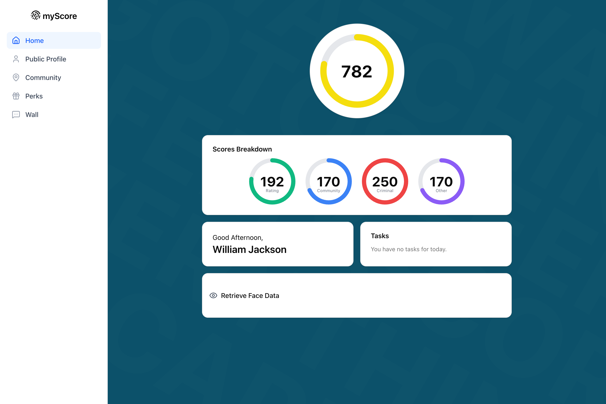

# My Score

A social-score experiment with peer ratings, community scores and score-based perks.

Built by William Jackson and Yiming He for the **2025 QUT Code Network Hackathon**.

[](docs/media/dashboard.png)

Screenshot uses sample data.

## Run locally

Copy `env.example` to `.env` and configure its settings, including Redis and the OpenRouter API key.

```sh
npm ci
npx prisma generate
npx prisma migrate deploy
npm run dev
```

Open [localhost:3000](http://localhost:3000). Built with Next.js, Prisma and SQLite.
